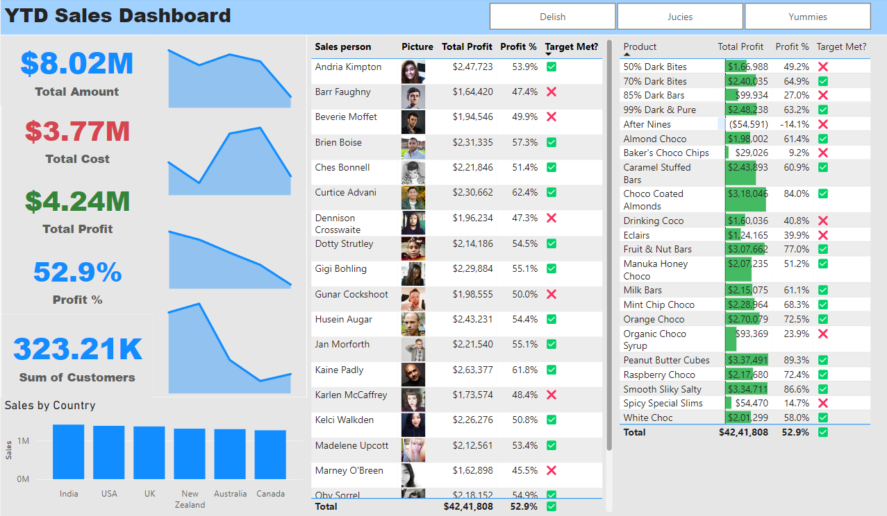

# Power BI - Year to Date Sales Dashboard for a Fictional Chocolate Company

A Beginner's project in Data Analysis

- This project presents the data involving sales figures of a confectionary company that involves Power BI and Excel.
- It tracks the perofrmance of the company across various product categories in various regions by sales executives over a span of time.
- The dashboard maked it easy to assess the sales and profits of each employee across various aprameters like time period, confectionary type, region, sales targets to be reached and profit generated.

